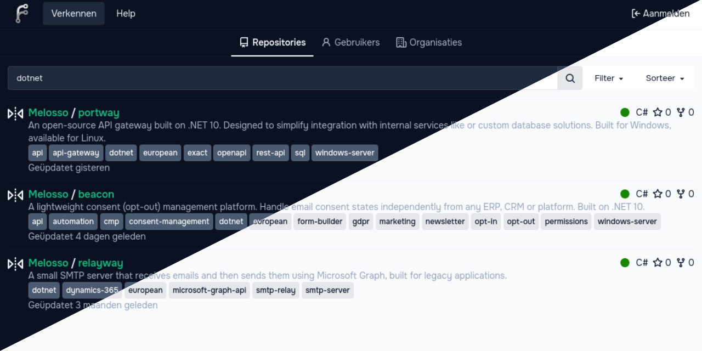
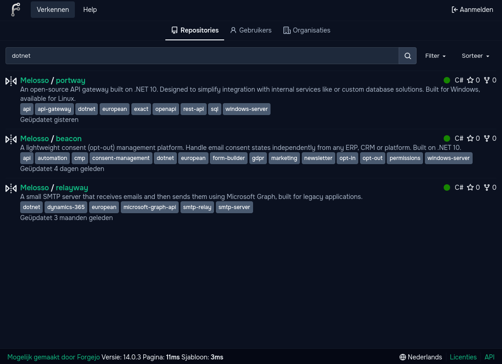
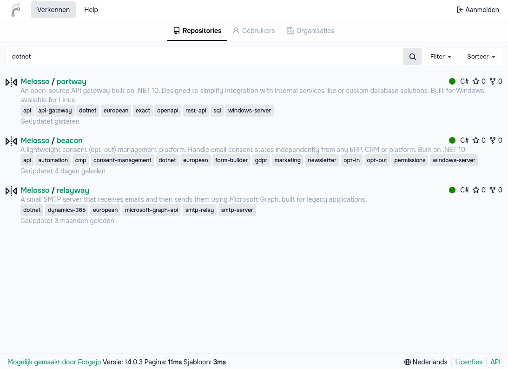

# Melosso for [Forgejo](https://forgejo.org/)

A brand-inspired theme for Forgejo. Might also work for Gitea, but I don't test against it.



> A dark theme and light theme for [Forgejo](https://forgejo.org/).

## Install

Check out the [install document](./INSTALL.md) for installation instructions. But, for anyone whom doesn't want to click the TLDR:

1. Drop the `.css` files into your `custom/public/assets/css/` directory.
2. Edit your `app.ini` under the `[ui]` section to add the themes to the `THEMES` list and optionally set `DEFAULT_THEME = melosso`.
3. Restart your instance to pick up the changes:
   ```bash
   sudo systemctl restart forgejo
   ```

## Screenshots



---




## License

Identically published as the original it's based on, which is: [GNU GPL 3.0](./LICENSE.md).

## Credits

Melosso is adapted from the [Dracula/Alucard theme](https://forge.axfive.net/Taylor/forgejo-theme-dracula) originally created by [Taylor C. Richberger](https://forge.axfive.net/Taylor).
